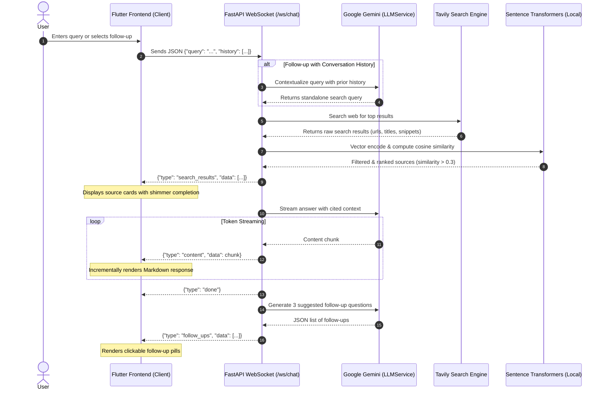

# ⚡ AI-Powered Answer Engine

[](https://flutter.dev/)
[](https://dart.dev/)
[](https://fastapi.tiangolo.com/)
[](https://www.python.org/)
[](https://ai.google.dev/)
[](https://tavily.com/)
[](https://developer.mozilla.org/en-US/docs/Web/API/WebSockets_API)

A full-stack, real-time AI conversational search and answer engine inspired by **Perplexity AI**. 

It combines live web search, semantic vector re-ranking, multi-model Gemini LLM streaming, conversational query contextualization, and interactive follow-ups with a dark-mode Flutter interface across Web, Desktop, and Mobile.

---

## 🌟 Key Features

- ⚡ **Real-Time Streaming Responses**: Answers stream token-by-token over low-latency WebSockets for instant perception and responsiveness.
- 🌐 **Live Web Grounding**: Integrates Tavily AI Search to fetch verified, up-to-the-minute web sources.
- 🧬 **Local Semantic Vector Re-Ranking**: Uses `sentence-transformers` (`all-MiniLM-L6-v2`) to compute cosine similarity between query embeddings and retrieved documents, filtering noise and highlighting the highest-relevance sources.
- 🔄 **Multi-Turn Contextual Search**: Resolves pronouns and contextual references in follow-up queries using prior chat history before executing web searches.
- 💡 **Dynamic Suggested Follow-Ups**: Automatically generates three relevant, clickable follow-up queries after each answer.
- 🎨 **Perplexity-Inspired Dark UI**: 
  - Collapsible sidebar with quick actions
  - Shimmering skeleton loaders powered by `skeletonizer`
  - Interactive source chips displaying domain, title, and direct links
  - Rich Markdown rendering with code blocks and list formatting
  - Threaded multi-turn conversation layout
- 🛡️ **Multi-Model LLM Resilience**: Cascade fallback across Gemini models (`gemini-3.6-flash` &rarr; `gemini-3.5-flash` &rarr; `gemini-3.5-flash-lite`) to ensure continuous uptime and minimize rate-limit disruptions.
- 🪵 **Centralized App Logging**: Formatted, tagged, level-based logging for both Dart VM / browser console and Python backend.

---

## 🏗️ Architecture & Data Flow



---

## 💻 Tech Stack

### Frontend (Flutter)
- **Framework**: Flutter 3 (Dart SDK `^3.12.2`)
- **Networking & WebSockets**: `web_socket_client`
- **Markdown & Code Rendering**: `flutter_markdown`
- **Typography & Theme**: `google_fonts` (Inter, IBM Plex Mono)
- **Skeleton Shimmer**: `skeletonizer`
- **Platforms Supported**: Web, Windows, macOS, Linux, Android, iOS

### Backend (Python)
- **Framework**: FastAPI + Uvicorn (`fastapi-cli`)
- **LLM SDK**: `google-genai` (Gemini API)
- **Embeddings & Vector Ranking**: `sentence-transformers` (`all-MiniLM-L6-v2`), `numpy`
- **Web Search**: `tavily-python`
- **Configuration & Validation**: `pydantic`, `pydantic-settings`, `python-dotenv`

---

## 📂 Project Directory Structure

```text
AI-powered-answer-engine/
├── lib/                               # Flutter Frontend
│   ├── main.dart                      # App entrypoint & dark theme configuration
│   ├── pages/
│   │   ├── home_page.dart             # Perplexity-style home search screen
│   │   └── chat_page.dart             # Multi-turn conversation thread page
│   ├── services/
│   │   └── chat_web_services.dart     # WebSocket client & event streams
│   ├── theme/
│   │   └── colors.dart                # Design tokens & color palette
│   ├── utils/
│   │   └── app_logger.dart            # Level-based tagged frontend logger
│   └── widget/
│       ├── answer_section.dart        # Markdown renderer, streaming, copy actions
│       ├── follow_up_section.dart     # Dynamic suggested chips & follow-up input
│       ├── search_bar_button.dart     # Focus & Attach action chips
│       ├── search_section.dart        # Centered home hero search bar
│       ├── side_bar.dart              # Collapsible navigation drawer
│       ├── side_bar_buttons.dart      # Navigation icons and labels
│       └── sources_section.dart       # Horizontal scrolling source citations
├── server/                            # FastAPI Backend
│   ├── .env.example                   # Environment variable template
│   ├── config.py                      # Pydantic BaseSettings loader
│   ├── main.py                        # FastAPI app & WebSocket endpoint (/ws/chat)
│   ├── requirements.txt               # Python package dependencies
│   ├── pydantic_models/
│   │   └── chat_body.dart             # Request schemas (ChatBody)
│   └── services/
│       ├── llm_service.py             # Gemini streaming, contextualization & follow-ups
│       ├── search_service.py          # Tavily API web search integration
│       └── sort_source_service.py     # SentenceTransformer cosine re-ranking
├── pubspec.yaml                       # Flutter dependencies and metadata
└── README.md                          # Project documentation
```

---

## 🚀 Quick Start Guide

### 1. Prerequisites

Ensure you have the following installed:
- [Flutter SDK](https://docs.flutter.dev/get-started/install) (3.12+ recommended)
- [Python 3.10+](https://www.python.org/downloads/)
- API Keys:
  - **Tavily API Key**: Obtain from [app.tavily.com](https://app.tavily.com/)
  - **Google Gemini API Key**: Obtain from [Google AI Studio](https://aistudio.google.com/)

---

### 2. Backend Setup

1. **Navigate to the server directory**:
   ```bash
   cd server
   ```

2. **Create and activate a virtual environment**:
   - **Windows (PowerShell)**:
     ```powershell
     python -m venv venv
     .\venv\Scripts\Activate.ps1
     ```
   - **macOS / Linux**:
     ```bash
     python3 -m venv venv
     source venv/bin/activate
     ```

3. **Install dependencies**:
   ```bash
   pip install -r requirements.txt
   ```

4. **Configure environment variables**:
   Create a `.env` file in the `server/` directory (or copy from `.env.example`):
   ```env
   TAVILY_API_KEY=your_tavily_api_key_here
   GEMINI_API_KEY=your_gemini_api_key_here
   ```

5. **Start the FastAPI backend**:
   ```bash
   fastapi dev main.py
   ```
   *The server will start listening at `http://localhost:8000` with WebSockets available at `ws://localhost:8000/ws/chat`.*

---

### 3. Frontend Setup

1. **Navigate to the project root**:
   ```bash
   cd ..
   ```

2. **Install Flutter packages**:
   ```bash
   flutter pub get
   ```

3. **Run the Flutter application**:
   - **For Web (Chrome)**:
     ```bash
     flutter run -d chrome
     ```
   - **For Windows Desktop**:
     ```bash
     flutter run -d windows
     ```
   - **For Mobile (Android / iOS)**:
     ```bash
     flutter run
     ```

---

## 📡 WebSocket Protocol

The Flutter client and Python server communicate bidirectionally over `ws://localhost:8000/ws/chat` using JSON frames:

### 1. Client Request
```json
{
  "query": "Who is the CEO of Google and what is their background?",
  "history": [
    {
      "query": "Previous question",
      "answer": "Previous response text"
    }
  ]
}
```

### 2. Server Responses

#### A. Source Citations (`search_results`)
Emitted after Tavily search and SentenceTransformer re-ranking completes:
```json
{
  "type": "search_results",
  "data": [
    {
      "title": "Sundar Pichai - Wikipedia",
      "url": "https://en.wikipedia.org/wiki/Sundar_Pichai",
      "content": "Pichai Sundararajan is an American business executive...",
      "score": 0.784
    }
  ]
}
```

#### B. Streaming Content Token (`content`)
Emitted repeatedly as Gemini generates markdown text:
```json
{
  "type": "content",
  "data": "Sundar Pichai is the CEO of Alphabet and Google... "
}
```

#### C. Completion Signal (`done`)
Signifies the current answer stream has concluded:
```json
{
  "type": "done"
}
```

#### D. Suggested Follow-Ups (`follow_ups`)
Emitted after answer completion with three logical next steps:
```json
{
  "type": "follow_ups",
  "data": [
    "What degrees does Sundar Pichai hold?",
    "When did he become the CEO of Google?",
    "What key products did he lead before becoming CEO?"
  ]
}
```

#### E. Error Event (`error`)
```json
{
  "type": "error",
  "data": "Error message description"
}
```

---

## ⚙️ Configuration & Environment Variables

| Variable | Required | Description |
| :--- | :---: | :--- |
| `TAVILY_API_KEY` | **Yes** | API key used for executing real-time web searches via Tavily. |
| `GEMINI_API_KEY` | **Yes** | Google Gemini API key used for query contextualization, answer generation, and follow-up creation. |

---

## 🛡️ Engineering Highlights

- **UTF-8 Stream Configuration**: Ensures UTF-8 encoding across Windows terminal environments to avoid Unicode/emoji encode exceptions.
- **Normalized Vector Dot-Product**: Vector similarities between query and documents are computed using normalized embeddings, optimizing ranking time for low-latency delivery.
- **Broadcast Controllers**: Flutter `StreamController.broadcast()` instances allow seamless cross-route event subscriptions without state desynchronization.
- **Context Preservation**: Follow-up questions leverage conversation history to resolve contextual pronouns (e.g., *"How old is he?"* &rarr; *"How old is Sundar Pichai?"*), ensuring web search engines retrieve pertinent documents.

---
